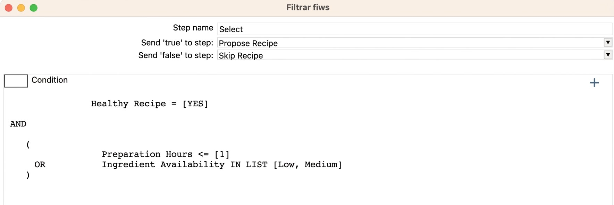
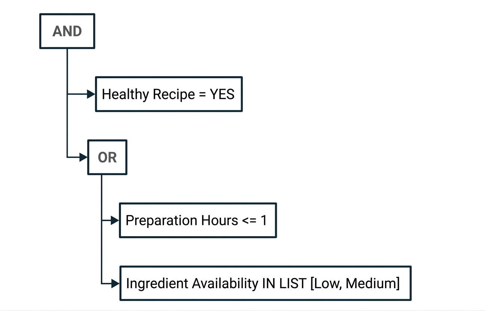
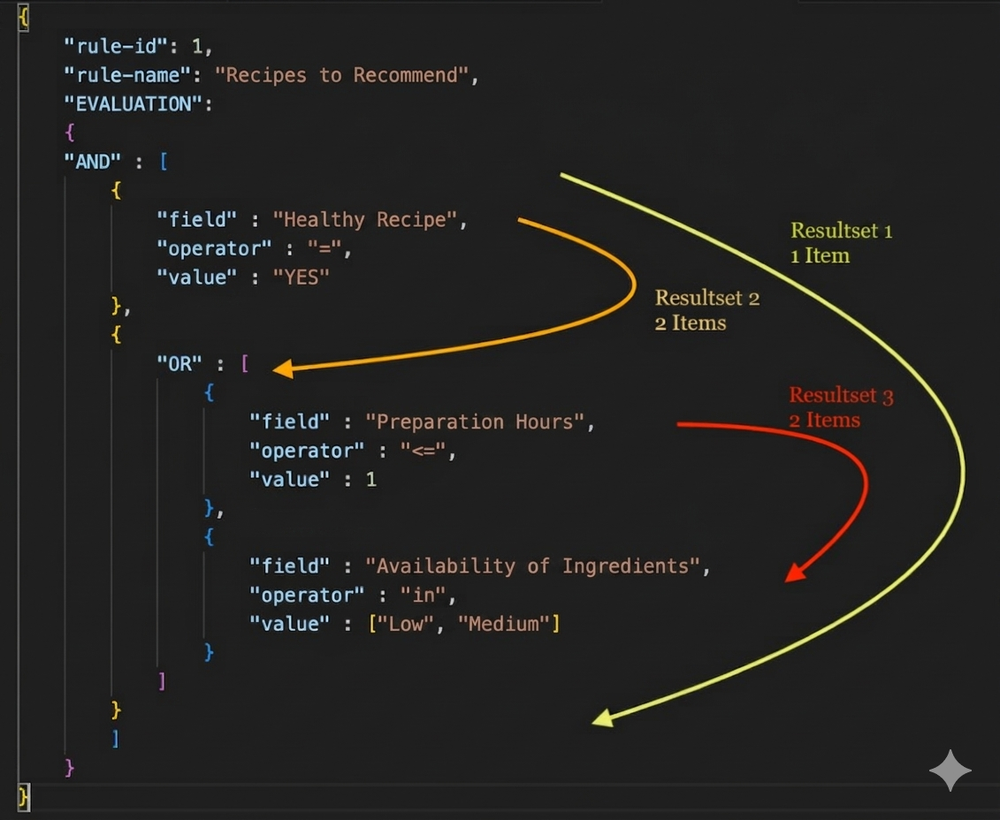

## Notes on an example of a rule engine using PL/SQL in Oracle

I have always liked rule engines embeded into IT solutions. At its simplest, I view a rule as a set of conditions that, when applied to an input, yields a "true" result if the rule is met, or "false" otherwise.

That sounds a lot like a SQL filter clause, doesn't it?

For example:

__SELECT COUNT(*) FROM Recipe__
__WHERE "HoursMaking" <= 1 AND "IngredientsAvailability" IN ('Low', 'Mid')__

This is essentially saying: count all recipes where the preparation time is one hour or less and ingredient availability is low or medium (a true condition); any records excluded do not meet that condition (the condition evaluates to false).

And while the example above returns all records that positively satisfy a specific logic, much like a rule engine does, my vision of a rule engine goes a bit further including:

- It does not require code changes or recompilation to apply new rules; it can interpret changes in real time.
- A rule logic can be simple or complex, yet the rule engine can still interpret it without code modifications, making it agnostic to the rule's representation.
- The system does not fail if the input data schema does not match the schema being evaluated; it simply returns a "false" result because the rule is not met, making it agnostic to the input data's metadata.

Taking into account the previous points, a rule engine is a very flexible part, changes in the rules do not imply changes or adaptations in the part that executes them (unless you want to add special use cases such as specific operators). This makes it ideal for solutions aimed at business users, where it is the user who defines the rule; or environments where criteria change easily, such as in the financial world (precisely rule engines have found their popularity there).

There are several popular rules engines; For example, Drools translates rules implemented as a set of “IFs”, or we have GoRules, where you can draw rules as boxes that apply logic to the data and whose output can be the input of other boxes with other logic.

In all cases the representation of the rules lives outside the code, and from the moment the rule changes, it is automatically available to be applied with the new incoming data.

So, following the idea of ​​what was explained before, I thought I could share, how to make a rule engine using Oracle PL/SQL, since it is a fairly common database these days. The same idea I will share can be carried over to several other current database engines.

Let's imagine that we want to make a solution that allows a non-IT user to design a rule using a screen or template, and then a code living in Oracle is able to understand it and apply it to a data input from any table or SQL query to obtain the rows that comply or not with said logic.

Our exercise could be something like this:

We have a set of data that comes from an imaginary recipe record and we are going to focus on certain attributes:

```markdown
| # | Base Ingredient | Preparation Hours | Ingredient Availability | Healthy Recipe |
|---|------------------|--------------------|--------------------------|-----------------|
| 1 | Fish             | 0.5                | Medium                   | YES             |
| 2 | Turkey           | 5                  | High                     | YES             |
| 3 | Japanese Wagyu   | 0.5                | Low                      | YES             |
| 4 | Chorizo          | 1.5                | High                     | NO              |
```

Then, the user would like to design a logic that allows him to filter from the recipe record, and according to his own criteria, which of these he could recommend and which he could not. Then the user decides the following using an interface:

Tell me the healthy recipes that also do not require more than an hour to prepare or whose ingredients are affordable to obtain.

In a user interface it could look something like this:



As you can see, this could turn into a nested set of conditions, so we need a flexible format to represent this logic; implementing it using tables in a relational data model would be complex due to its structured nature.

### JSON to the rescue:

If you look closely, the preceding logic could be represented as a set of hierarchies:



Each logical operator acts as a branch; attached to these branches are the leaves, the logical subsets with the attributes to be used, the operators, and the reference values.

The JSON format offers not only flexibility but also structure, allowing you to traverse the content and locate values ​​associated with keys or attributes, much like working with database tables and columns, but without the headache of altering the database schema (such as adding columns) to accommodate logic of varying formats.

Consequently, our rule can be effectively represented in JSON format like this:

```
{
  "AND" : [
    {
      "field" : "Healthy Recipe",
      "operator" : "=",
      "value" : "YES"
    },
    {
      "OR" : [
        {
          "field" : "Preparation Hours",
          "operator" : "<=",
          "value" : 1
        },
        {
          "field" : "Ingredient Availability",
          "operator" : "in",
          "value" : ["Low", "Medium"]
        }
      ]
    }
  ]
}
```

We could also enrich the information defining the rule; for instance, by adding an identifying name and creating two sections: one for identification or descriptions and another for the rule's logic. This makes it more organized and self-explanatory.

```
{
  "rule-id": 1,
  "rule-name": "Recipes to recommend",
  "EVALUATION": {
    "AND" : [
      {
        "field" : "Healthy Recipe",
        "operator" : "=",
        "value" : "YES"
      },
      {
        "OR" : [
          {
            "field" : "Preparation Hours",
            "operator" : "<=",
            "value" : 1
          },
          {
            "field" : "Ingredient Availability",
            "operator" : "in",
            "value" : ["Low", "Medium"]
          }
        ]
      }
    ]
  }
}
```

### Iterating through our logic:

Now, we simply need to find a way to navigate the logic hierarchy—or tree—represented in JSON format. Since we cannot know the number of levels in the hierarchy beforehand, we must find a way to traverse this structure and locate the necessary information in real time.

### Leveraging existing techniques:

Recursion is a technique used in various programming languages ​​where a function calls itself, executing the same logic repeatedly but using the output of the previous iteration as the input for the next; this is the ideal approach for navigating our hierarchical rule representation.

To achieve our goal, we have two options available in Oracle: the "CONNECT" command and Common Table Expressions (CTEs). We will use the latter, as it is also supported by other database engines.

While there is extensive documentation on CTEs, our focus here is to demonstrate the specific use case of traversing our JSON data, as illustrated in the following figure:



We can identify the following steps in our recursion process:

The first step represents our logic, specifically, the initialization of the dataset or the root of the hierarchy. This is the JSON object corresponding to our whole logic, shown as "Result Set 1".
The second part is a recursive call, meaning the query definition calls itself. The process involves extracting each child item from the result of the previous iteration, leaving a remainder that serves as the input for the next call; this continues until no further items are found. This is illustrated as "Result Sets 2 and 3."

You can try query this hierarchy and iterate using the following Oracle PL/SQL code:

```
WITH json_iterate (priority, operator, evaluation, hierarchy_level, parent_id, id) AS
    (
      ------------ Inicialización -------------------
        SELECT 1 priority, DIP.get_first_key(evaluation) operator, cast(evaluation as varchar2(2000)) evaluation, 1 hierarchy_level, '11' parent_id, '11' id
        FROM json_table(v_rule_document, '$.EVALUATION' COLUMNS evaluation VARCHAR2(2000) FORMAT JSON PATH '$')
    ---------------------------------------------
        UNION ALL
      ----------------- Recursion --------------------------------
        SELECT ROWNUM priority, DIP.get_first_key(child) operator, cast(child as varchar2(2000)) child, json_iterate.hierarchy_level + 1
        , to_char(json_iterate.hierarchy_level) || to_char(json_iterate.priority) parent_id
        , to_char(json_iterate.hierarchy_level + 1) || to_char(ROWNUM) id
        FROM json_iterate, json_table(json_iterate.evaluation, '$.*[*]' COLUMNS child VARCHAR2(2000) FORMAT JSON PATH '$', "CHECK" VARCHAR2(5) EXISTS PATH '$.*') as child
        where child is not null
        and "CHECK" = 'true' --es un elemento json
        and hierarchy_level < 100 --evita ejecución infinita
  ----------------------------------------------------
    )
    , parent_operator AS
    (
        SELECT id, operator FROM json_iterate where operator <> 'field'
    )
    select b.operator parent_operator, a.operator item_type, a.parent_id, a.id, a.evaluation
    bulk collect into v_denormalized_rules
    from json_iterate a
    left join parent_operator b on a.parent_id = b.id
    --exclude root element--
    where a.id <> '11'
    order by a.hierarchy_level desc, a.priority;
```

| PARENT_OPERATOR | ITEM_TYPE | PARENT_ID | ID | EVALUATION |
| :--- | :--- | :--- | :--- | :--- |
| OR | field | 22 | 31 | `{"field":"Preparation Hours","operator":"<=","value":1}` |
| OR | field | 22 | 32 | `{"field":"Ingredient Availability","operator":"in","value":["Low","Medium"]}` |
| AND | field | 11 | 21 | `{"field":"Healthy Recipe","operator":"=","value":"YES"}` |
| AND | OR | 11 | 22 | `{"OR":[{"field":"Preparation Hours","operator":"<=","value":1},{"field":"Ingredient Availability","operator":"in","value":["Low","Medium"]}]}` |
| AND | AND | 11 | 11 | `{"AND":[{"field":"Healthy Recipe","operator":"=","value":"YES"},{"OR":[{"field":"Preparation Hours","operator":"<=","value":1},{"field":"Ingredient Availability of ...` |

As you see you can split the hierarchy into leafs with the corresponding parent represented as PARENT_ID, then, we can evaluate by leaf and we can relate each one based into their parent operator.

### There is some support function to be created in advance

- A function to obtain the first key of that JSON element (key) Our function allows us to obtain the value of the ITEM_TYPE field __get_first_key__
- A function that can determine the class or data type of the values we are using, in JSON we can have not only attributes with simple data types, but lists or another JSON object. It will help me understand if the “value” object of the logic is a number, a string of characters, or an array or list. __check_value_class__
- A function to understand if an element or value is within a list of values, this is a homologation of the SQL IN operator. __check_if_element_in_array__
- A function that takes the logic to be evaluated in JSON format and returns true or false depending on the rule to be applied. This will be our engine. __inline_execute_logic__
